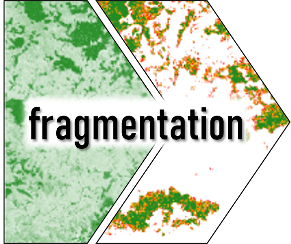
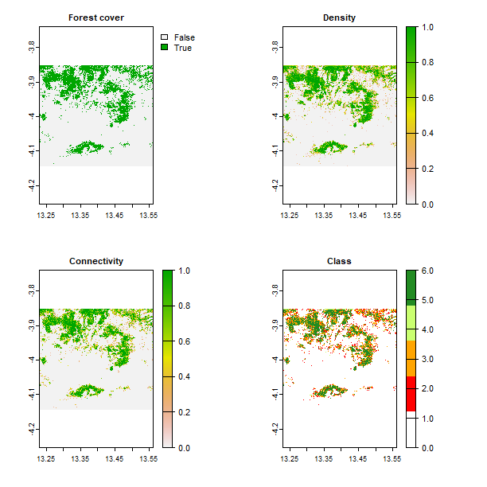

# fragmentation

  

Calculate forest (or similar) fragmentation connectivity, density, and fragmentation class as per <a href='https://www.jstor.org/stable/26271763'>Riitters et al. 2020</a> *Conservation Ecology* 4:3. (also see <a href='https://www.ecologyandsociety.org/vol4/iss2/art3/errata/january26.2001.html'>errata</a>). Forest density, connectivity, and fragmentation indices can be calculated for binary (forest/non-forest) and continuous rasters.

# Installing the package
You can install the package using:

`remotes::install_github('adamlilith/fragmentation', dependencies = TRUE)`

You may need to install the `remotes` package first.

# Forest fragmentation indices
Riitters et al. define 5 classes of fragmentation, plus an "edge/" case, based on the density and connecitivity of cells with/without forest. These are:
1. Patch (density < 0.4)
2. Transitional (0.4 <= density < 0.6)
3. Perforated (density >= 0.6 & density - connectivity > 0)
4. Edge (density >= 0.6 & density - connectivity < 0)
5. Undetermined (density >= 0.6 & density == connectivity)
6. Interior (density == 1)

The fifth class, "undetermined", is the edge case and rarely occurs. Users of the functions in `fragmentation` can decide to use the "undetermined" class or to assign these rare cases to one of the other classes.

# Package functions
The package contains two functions and one raster used for examples. The functions are:
* `fragBinary`: Calculate fragmentation for rasters with binary values (forest/not forest)
* `fragCont`: Calculate fragmentation for rasters with continuous values (e.g., perfcent forest)

Here is an example of input (top left) and output (all others) from the `fragBinary` function for an area located in the eastern pottion of the Republic of the Congo:

Adam